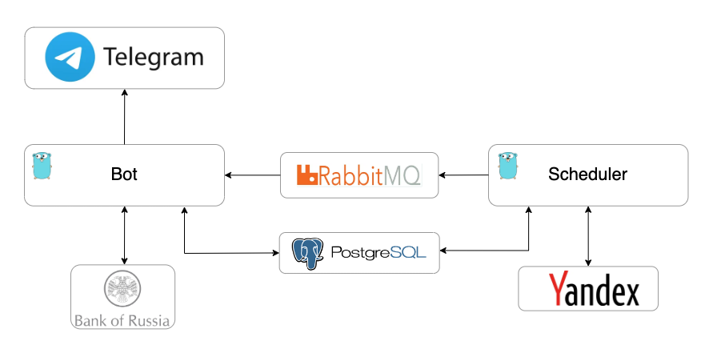

## Overview

Telegram bot assistant.
Used to:
- create reminders
- manual of console commands (git, docker, linux, k8s)
- getting a weather forecast
- exchange rates

## Architecture

    

- Telegram - UI
- Bot
    - save events in `database`
    - get exchange rates from `Bank of Russia`
- Scheduler
    - get weather forecast from `yandex api` once in 40 minutes and sends it to `queue`
    - tracks upcoming events that need to be recalled(day, hour before event)

## DevOps
Service has DevOps pipeline using GitHub-Actions.

Stages:

- build `Bot` and `Scheduler` in image and push them in DockerHub registry
- deploy to VPS
